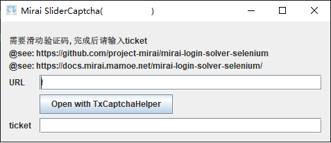

# Mirai API HTTP 安装

!!! info "注意"

    本教程需要：

    - 基础文件操作能力
    - 基础终端使用能力 (按 Tab 与 Enter)
    - 搜索引擎使用能力
    - 一个脑子

    什么? 你没有? 请退出吧, 本教程不适合你。

!!! note "提示"

    你可以在 [这里](https://github.com/ZhaoZuohong/mirai-mah-docker) 找到关于使用 `docker` 安装 `mirai` 的信息.

# 1. 安装 mirai-console-loader

!!! tip "提示"

    若你已经安装了 `mirai-console`, 请直接移步 [2. 安装与配置 mirai-api-http](#2-mirai-api-http)

从 [`mcl-installer release`](https://github.com/iTXTech/mcl-installer/releases/latest) 下载适合 **你电脑架构** 的版本.

!!! note "如果你实在不知道用哪个版本, 可以按照你用的操作系统试过去."

!!! warning "在下载完成后直接移动到目标安装位置, 并创建沿途的文件夹."

完成后, 打开你的终端, 输入:

```bash
./mcl-installer # 使用 Tab 键补全路径, 之后回车.
```

你应该会看到 **类似** 的东西:

```
iTXTech MCL Installer 1.0.3 [OS: windows]
Licensed under GNU AGPLv3.
https://github.com/iTXTech/mcl-installer

iTXTech MCL and Java will be downloaded to "F:\PythonProjects\mah-pure-inst"

Checking existing Java installation.
...
Would you like to install Java? (Y/N, default: Y)
```

如果你不会英文, 可以一路回车了.

之后你大概能看到这样的结构:

```
MCL
│
├───java
│       ...
│
├───scripts
│       ...
│   LICENSE
│   mcl
│   mcl.cmd
│   mcl.jar
│   README.md
```

之后, 运行

```bash
./mcl
```

你会看到类似的输出:

```
[INFO] Verifying "net.mamoe:mirai-console" v
[ERROR] "net.mamoe:mirai-console" is corrupted.
Downloading ......
xxxx-xx-xx xx:xx:xx I/main: Starting mirai-console...
......
xxxx-xx-xx xx:xx:xx I/main: mirai-console started successfully.

>
```

此时输入 `/autoLogin add <你的QQ号> <你的QQ密码>` 并回车.

应该会显示 `已成功添加 '<你的QQ号>'.`

!!! error "在向他人报告问题时 _永远_ 不要泄露你的敏感信息."

之后先输入 `stop` 并回车, 退出 `mirai-console`.

# 2. 安装与配置 mirai-api-http

=== "通过 MCL 管理"

    只需运行
    ```bash
    ./mcl --update-package net.mamoe:mirai-api-http --channel stable-v2 --type plugin
    ./mcl -u
    ```
    即可.

=== "手动安装"

    从 [`mirai-api-http release`](https://github.com/project-mirai/mirai-api-http/releases/latest) 页下载最新的 `.jar` 文件.

    文件名像这样: `mirai-api-http-v2.X.X.mirai.jar`

    放到 `mirai-console` 安装目录下的 `plugins` 文件夹内, **不要做任何其他操作**.

# 3. 登录 QQ

执行 `./mcl` 启动 `mirai-console` .

如果直接显示 `Event: BotOnlineEvent(bot=Bot(<你的QQ号>))` 那么恭喜你, 你已经 [完成](#4) 了.

但是... 如果像下面那样弹出一个弹窗, 那你还要往下看.

!!! note "Linux NoGUI 用户请在桌面环境下先配置好, 之后复制 `bots` 文件夹."



点击 `Open with TxCaptchaHelper`, 会弹出一个新窗口.


在手机上下载 [`TxCaptchaHelper`](https://maupdate.rainchan.win/txcaptcha.apk) 并安装.

打开后会有如下界面:

<figure markdown>
  {width="200"}
</figure>

此时输入上方的 **4 位数** 请求码, 点击 `下一步` , 可以看到:

<figure markdown>
  {width="200"}
</figure>

完成滑块验证, 之后你就可以在电脑窗口中点击 `确定` 了.

<figure markdown>
  之后还会有一个设备锁, 如图:
  {align="right", width="500"}
</figure>

复制里面的 `url` 至 浏览器, 按照提示完成即可.

# 4. 完成

在 `config/net.mamoe.mirai-api-http` 下, 你会找到 `setting.yml` 文件.

改成如下内容 (注意依照注释更改):

```yaml
# file: "MCL/config/net.mamoe.mirai-api-http/setting.yml"
## 配置文件中的值，全为默认值

## 启用的 adapter, 内置有 http, ws, reverse-ws, webhook
adapters:
  - http
  - ws

## 是否开启认证流程, 若为 true 则建立连接时需要验证 verifyKey
enableVerify: true
verifyKey: ServiceVerifyKey

## 开启一些调试信息
debug: false

## 是否开启单 session 模式, 不建议开启
singleMode: false

## 历史消息的缓存大小
## 同时，也是 http adapter 的消息队列容量
cacheSize: 4096

## adapter 的单独配置，键名与 adapters 项配置相同
adapterSettings:
  ## 详情看 http adapter 使用说明 配置
  http:
    host: localhost
    port: 8080
    cors: ["*"]

  ## 详情看 websocket adapter 使用说明 配置
  ws:
    host: localhost
    port: 8080
    reservedSyncId: -1
    # 建议确保为负数，否则可能出 bug
```

至此, 你已经完成了 `mirai-api-http` 的安装与配置. 享受使用 `Graia Framework` 开发吧!
