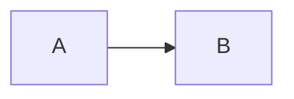

# 文档设置

## 切换主题色

> 按下对应颜色即可切换.

> 默认颜色: `indigo`.

<button data-md-color-primary="red"><code>red</code></button>
<button data-md-color-primary="pink"><code>pink</code></button>
<button data-md-color-primary="purple"><code>purple</code></button>
<button data-md-color-primary="deep-purple"><code>deep purple</code></button>
<button data-md-color-primary="indigo"><code>indigo</code></button>
<button data-md-color-primary="blue"><code>blue</code></button>
<button data-md-color-primary="light-blue"><code>light blue</code></button>
<button data-md-color-primary="cyan"><code>cyan</code></button>
<button data-md-color-primary="teal"><code>teal</code></button>
<button data-md-color-primary="green"><code>green</code></button>
<button data-md-color-primary="light-green"><code>light green</code></button>
<button data-md-color-primary="lime"><code>lime</code></button>
<button data-md-color-primary="yellow"><code>yellow</code></button>
<button data-md-color-primary="amber"><code>amber</code></button>
<button data-md-color-primary="orange"><code>orange</code></button>
<button data-md-color-primary="deep-orange"><code>deep orange</code></button>
<button data-md-color-primary="brown"><code>brown</code></button>
<button data-md-color-primary="grey"><code>grey</code></button>
<button data-md-color-primary="blue-grey"><code>blue grey</code></button>
<button data-md-color-primary="black"><code>black</code></button>
<button data-md-color-primary="white"><code>white</code></button>

### 辅助色

> 按下对应颜色即可切换.

> 默认颜色: `indigo`.

> 辅助色控制文档导航高亮与图表颜色.

<button data-md-color-accent="red"><code>red</code></button>
<button data-md-color-accent="pink"><code>pink</code></button>
<button data-md-color-accent="purple"><code>purple</code></button>
<button data-md-color-accent="deep-purple"><code>deep purple</code></button>
<button data-md-color-accent="indigo"><code>indigo</code></button>
<button data-md-color-accent="blue"><code>blue</code></button>
<button data-md-color-accent="light-blue"><code>light blue</code></button>
<button data-md-color-accent="cyan"><code>cyan</code></button>
<button data-md-color-accent="teal"><code>teal</code></button>
<button data-md-color-accent="green"><code>green</code></button>
<button data-md-color-accent="light-green"><code>light green</code></button>
<button data-md-color-accent="lime"><code>lime</code></button>
<button data-md-color-accent="yellow"><code>yellow</code></button>
<button data-md-color-accent="amber"><code>amber</code></button>
<button data-md-color-accent="orange"><code>orange</code></button>
<button data-md-color-accent="deep-orange"><code>deep orange</code></button>

#### 预览辅助色

